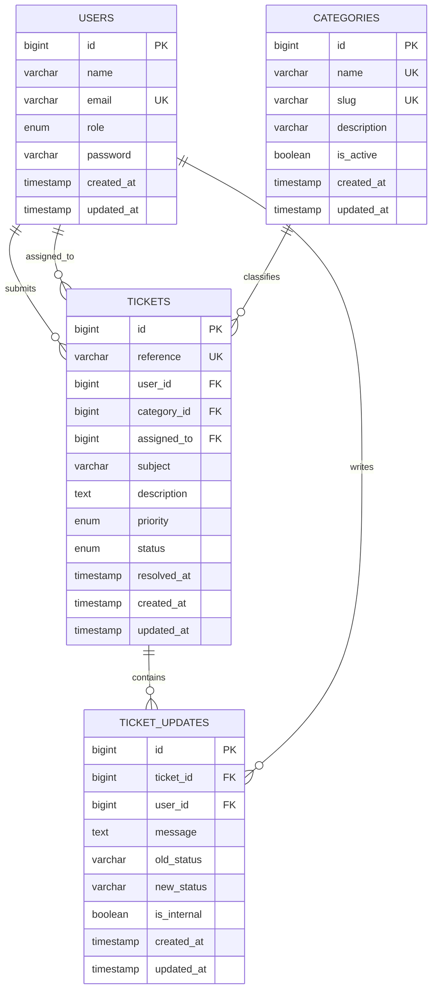

# Campus IT Help Desk — Project Report

## 1. Project overview

Technical support requests are often reported through informal messages. This makes it difficult to see which problems are urgent, who is responsible for them, and whether they were resolved. Campus IT Help Desk places the complete process in one web application.

The system has two roles. A regular user reports a problem and follows its progress. An administrator manages the support queue, assigns work, communicates with the user, records private notes, and closes completed requests.

## 2. Objectives

- Store technical support requests in a structured relational database.
- Give each request a unique, readable reference number.
- Keep one user from viewing or changing another user's tickets.
- Give IT staff a clear queue with useful search and filters.
- Preserve a chronological history of communication and status changes.
- Separate public replies from internal staff notes.
- Prevent invalid or destructive category operations.
- Provide a responsive interface that works on desktop and mobile screens.

## 3. Functional requirements

| Area | Implemented behaviour |
|---|---|
| Authentication | Register, login, logout, hashed passwords, regenerated sessions |
| User dashboard | Counts for all, open, active, and completed requests plus recent tickets |
| Ticket submission | Subject, category, priority, detailed description, validation |
| Ticket tracking | Reference, status, assigned technician, timestamps, conversation history |
| Ticket editing | Allowed only while a ticket is open and unassigned |
| User replies | Public follow-up messages on tickets owned by the signed-in user |
| Admin dashboard | Operational counts, workload by status, recent urgent tickets |
| Admin queue | Search plus status, priority, category, and assignment filters |
| Ticket handling | Assignment, status and priority changes, public response, internal note |
| Category CMS | Create, rename, describe, enable/disable, guarded deletion |

## 4. Architecture

The project follows Laravel's Model–View–Controller structure.

| Layer | Responsibility | Main locations |
|---|---|---|
| Models | Data structure, relationships, query scopes, ticket rules | `app/Models` |
| Views | Blade pages, forms, tables, badges, responsive layout | `resources/views` |
| Controllers | Request handling and workflow coordination | `app/Http/Controllers` |
| Validation | Field rules for tickets, replies, and admin updates | `app/Http/Requests` |
| Authorization | Ticket ownership rules and administrator middleware | `app/Policies`, `app/Http/Middleware` |
| Database | Versioned schema and repeatable sample data | `database/migrations`, `database/seeders` |
| Routing | Public, authenticated, and administrator endpoints | `routes/web.php` |

## 5. Database design

### Relationships

- One user can submit many tickets.
- One administrator can be assigned many tickets; assignment is optional.
- One category can classify many tickets.
- One ticket can have many updates.
- One user or administrator can write many updates.

### Third normal form

The core data is in third normal form:

1. Every field stores one value. Ticket messages are separate rows rather than a repeated group inside `tickets`.
2. Every non-key field depends on the whole primary key. Each table uses a single primary key and describes one entity.
3. Non-key fields do not depend on other non-key fields. Category details are stored once in `categories`, user details once in `users`, and update authors once in `users`. Tickets keep foreign keys instead of duplicating those descriptions.

This design reduces repeated data and prevents inconsistent category or user information.

## 6. Important business rules

- A new ticket begins with `open` status.
- Each ticket receives a unique reference in the form `HD-YYMMDD-NNNN`.
- Priorities are `low`, `medium`, `high`, or `urgent`.
- Statuses are `open`, `in_progress`, `waiting_user`, `resolved`, or `closed`.
- A regular user can access only tickets they created.
- A ticket can be edited by its owner only while it is open and unassigned.
- Closed tickets do not accept further user replies.
- Internal notes are visible only in the administration area.
- Setting a ticket to resolved or closed records `resolved_at`; reopening it clears that value.
- A category already used by tickets cannot be deleted. It can be disabled instead so historical data remains valid.

## 7. Security and data integrity

- Passwords are stored with Laravel's secure password hashing.
- Login sessions are regenerated after authentication and invalidated on logout.
- Forms contain CSRF protection.
- Form Request classes reject missing, malformed, or out-of-range input.
- Eloquent and parameterized queries prevent direct SQL injection through form fields and filters.
- A policy enforces ticket ownership.
- Administrator routes require both authentication and the `admin` role.
- Mass-assignable model fields are explicitly listed.
- Foreign keys enforce valid users, categories, tickets, and authors.
- Delete behaviour is deliberate: ticket histories cascade with their ticket, category deletion is restricted, and deleted assignees become `NULL`.
- Blade's escaped output prevents stored form text from being rendered as executable HTML.
- Production instructions keep `APP_DEBUG=false` and `.env` outside Git.

## 8. Interface design

The layout uses semantic HTML and one consistent visual system. Navigation changes according to the current role. Forms keep labels next to their controls, validation messages appear beside the relevant field, and ticket states are shown as both text and colour-coded badges. Tables collapse into readable blocks on narrow screens. Colour is not the only indication of state.

The interface was intentionally kept appropriate for a university system: clear, restrained, and focused on the workflow instead of decorative effects.

## 9. Source code guide

| Location | Contents |
|---|---|
| `app/Models/Ticket.php` | Ticket constants, reference generation, relationships, scopes, labels |
| `app/Policies/TicketPolicy.php` | Ownership and update permissions |
| `app/Http/Controllers/TicketController.php` | User ticket workflow |
| `app/Http/Controllers/Admin/TicketController.php` | Admin search, filters, assignment, and status changes |
| `app/Http/Controllers/Admin/CategoryController.php` | Category CMS and deletion protection |
| `resources/views/tickets` | User ticket pages |
| `resources/views/admin` | Administration pages |
| `resources/css/app.css` | Responsive project styling |
| `database/migrations` | Relational structure and constraints |
| `database/seeders/DatabaseSeeder.php` | Demonstration accounts and tickets |
| `tests/Feature` | End-to-end HTTP workflow tests |

## 10. Verification

The automated suite contains 11 feature tests with 47 assertions. It verifies:

- guest pages and authentication;
- role-based redirects and administrator protection;
- ticket creation and ownership privacy;
- edit restrictions after assignment;
- public user replies and protection from internal-note input;
- administrator assignment, status changes, resolution timestamps, and internal notes;
- category creation, editing, deletion, and deletion protection.

The complete migrations and seed data were also run against MariaDB 10.4, which is compatible with the local XAMPP MySQL environment. Blade views compile successfully and the Vite production build completes without errors.

## 11. Scope and possible extensions

The submitted system covers the full ticket-management workflow required for the course. Suitable future additions would be file attachments, email notifications, password-reset email, service-level deadlines, and reporting charts. They are outside the current scope because they require external storage or mail services and are not necessary to demonstrate relational PHP development.

## 12. Course requirement mapping

| Project requirement | Evidence in this project |
|---|---|
| PHP web server | Laravel application served by PHP |
| Several connected tables | Four core tables with five foreign-key relationships |
| MySQL database | MySQL configuration, migrations, and standalone SQL script |
| User and administrator areas | Separate protected workflows and navigation |
| CMS functionality | Category management and full ticket administration |
| Advanced web design | Responsive custom layout, forms, filters, tables, and state badges |
| Normalization and ERD | Section 5 of this report |
| Source and SQL scripts | Complete repository plus `database/schema/mysql.sql` |
| Login details | Listed in `README.md` and the demonstration guide |
| Documentation and demonstration | This report plus `docs/DEMONSTRATION.md` |

